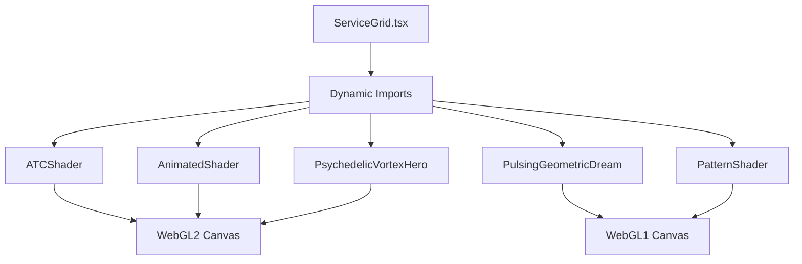

# Card Shader Effects Skill

This skill documents how the WebGL shader backgrounds are implemented for service cards in the Lumina Oracles project. The project uses 5 distinct shader components that cycle through the service grid cards.

## Architecture Overview



## Shader Components

### 1. ATCShader (`atc-shader.tsx`)
**WebGL Version:** WebGL2  
**Style:** Abstract cosmic flow with tanh-based color mapping

Key features:
- Uses `#version 300 es` GLSL
- Implements custom `tanh` fallback for compatibility
- Creates flowing cosmic patterns with vector-based iteration

### 2. AnimatedShader (`animated-shader-hero.tsx`)
**WebGL Version:** WebGL2  
**Style:** Fractal noise clouds with interactive pointer support

Key features:
- Full `WebGLRenderer` class with OOP architecture
- `PointerHandler` class for mouse/touch interaction
- Uses `fbm` (fractal Brownian motion) for cloud effects
- Pointer-reactive animations

### 3. PulsingGeometricDream (`pulsing-geometric-dream.tsx`)
**WebGL Version:** WebGL1  
**Style:** Pulsing circles with rotating grid boxes

Key features:
- SDF (Signed Distance Field) based rendering
- Smooth union operations for organic blending
- Inigo Quilez palette function for colors
- Vignette post-processing

### 4. PatternShader (`pattern-shader.tsx`)
**WebGL Version:** WebGL1  
**Style:** Interference pattern with rotating grid

Key features:
- Customizable via props (grid spacing, animation speed, rotation speed)
- Palette parameters (`paletteA`, `paletteB`, `paletteC`, `paletteD`)
- Box SDF with sinusoidal modulation
- 2D rotation matrix for pattern animation

### 5. PsychedelicVortexHero (`psychedelic-vortex-hero.tsx`)
**WebGL Version:** WebGL2  
**Style:** Mesmerizing vortex with polar coordinates

Key features:
- Most customizable with `ShaderParams` interface
- Built-in presets (`classic`, `intense`, `calm`, `neon`)
- Quality settings (`high`, `balanced`, `low`)
- Error callbacks and fallback support

---

## Implementation Pattern

All shader components follow this structure:

### 1. GLSL Shader Code (Strings)

```glsl
// Vertex Shader - Full-screen quad
const vsSource = `#version 100
attribute vec2 a_position;
void main() {
  gl_Position = vec4(a_position, 0.0, 1.0);
}`;

// Fragment Shader - Visual effect
const fsSource = `#version 100
precision highp float;
uniform vec2 u_resolution;
uniform float u_time;
// ... effect code
void main() {
  vec2 uv = (2.0 * gl_FragCoord.xy - u_resolution) / u_resolution.y;
  // ... calculate color
  gl_FragColor = vec4(color, 1.0);
}`;
```

### 2. React Component Setup

```tsx
const ShaderComponent: FC<Props> = (props) => {
  const canvasRef = useRef<HTMLCanvasElement>(null);
  const frameId = useRef<number>();

  useEffect(() => {
    const canvas = canvasRef.current;
    if (!canvas) return;

    // 1. Get WebGL context
    const gl = canvas.getContext("webgl") || canvas.getContext("webgl2");
    if (!gl) return;

    // 2. Compile shaders
    const vs = compileShader(gl.VERTEX_SHADER, vsSource);
    const fs = compileShader(gl.FRAGMENT_SHADER, fsSource);

    // 3. Link program
    const program = gl.createProgram();
    gl.attachShader(program, vs);
    gl.attachShader(program, fs);
    gl.linkProgram(program);

    // 4. Setup full-screen quad
    const quad = new Float32Array([-1,-1, 1,-1, -1,1, 1,1]);
    const buffer = gl.createBuffer();
    gl.bindBuffer(gl.ARRAY_BUFFER, buffer);
    gl.bufferData(gl.ARRAY_BUFFER, quad, gl.STATIC_DRAW);

    // 5. Get uniform locations
    const uTime = gl.getUniformLocation(program, "u_time");
    const uRes = gl.getUniformLocation(program, "u_resolution");

    // 6. Animation loop
    const render = (t: number) => {
      gl.useProgram(program);
      gl.uniform1f(uTime, t * 0.001);
      gl.uniform2f(uRes, canvas.width, canvas.height);
      gl.drawArrays(gl.TRIANGLE_STRIP, 0, 4);
      frameId.current = requestAnimationFrame(render);
    };
    requestAnimationFrame(render);

    // 7. Cleanup
    return () => cancelAnimationFrame(frameId.current!);
  }, []);

  return <canvas ref={canvasRef} className="w-full h-full" />;
};
```

### 3. Usage in ServiceGrid

```tsx
// Dynamic imports for SSR compatibility
const ATCShader = dynamic(() => import("@/components/atc-shader").then(mod => mod.ATCShader), { ssr: false });
const AnimatedShader = dynamic(() => import("@/components/animated-shader-hero").then(mod => mod.AnimatedShader), { ssr: false });
// ... more shaders

// Cycle through shaders
const Shaders = [ATCShader, AnimatedShader, PulsingGeometricDream, PatternShader, PsychedelicVortexHero];

{SERVICES.map((service, index) => {
  const ShaderComponent = Shaders[index % Shaders.length];
  return (
    <div className="relative">
      <div className="absolute inset-0 opacity-60">
        <ShaderComponent className="w-full h-full" />
      </div>
      {/* Card content */}
    </div>
  );
})}
```

---

## Creating a New Shader

### Step 1: Create the component file

```bash
touch components/my-new-shader.tsx
```

### Step 2: Define the fragment shader

Start with this template:

```glsl
const fsSource = `#version 100
precision highp float;

uniform vec2 u_resolution;
uniform float u_time;

void main() {
  // Normalize coordinates to [-1, 1] with aspect ratio correction
  vec2 uv = (2.0 * gl_FragCoord.xy - u_resolution) / u_resolution.y;
  
  // Create your effect here
  vec3 color = vec3(0.5 + 0.5 * sin(uv.x * 10.0 + u_time));
  
  gl_FragColor = vec4(color, 1.0);
}`;
```

### Step 3: Add to ServiceGrid

```tsx
const MyNewShader = dynamic(() => import("@/components/my-new-shader"), { ssr: false });

const Shaders = [ATCShader, AnimatedShader, PulsingGeometricDream, PatternShader, PsychedelicVortexHero, MyNewShader];
```

---

## Common GLSL Techniques Used

### Inigo Quilez Color Palette

```glsl
vec3 palette(float t, vec3 a, vec3 b, vec3 c, vec3 d) {
  return a + b * cos(6.28318 * (c * t + d));
}
```

### Signed Distance Functions (SDF)

```glsl
// Circle SDF
float sdCircle(vec2 p, float r) {
  return length(p) - r;
}

// Box SDF
float sdBox(vec2 p, vec2 b) {
  vec2 d = abs(p) - b;
  return length(max(d, 0.0)) + min(max(d.x, d.y), 0.0);
}

// Smooth union
float opSmoothUnion(float d1, float d2, float k) {
  float h = clamp(0.5 + 0.5*(d2-d1)/k, 0.0, 1.0);
  return mix(d2, d1, h) - k*h*(1.0-h);
}
```

### 2D Rotation Matrix

```glsl
mat2 rotate2d(float angle) {
  float c = cos(angle), s = sin(angle);
  return mat2(c, -s, s, c);
}
```

### Vignette Effect

```glsl
float vignette = 1.0 - dot(uv, uv) * 0.5;
color *= vignette;
```

---

## File References

| Component | Path | WebGL | Style |
|-----------|------|-------|-------|
| ATCShader | [atc-shader.tsx](file:///c:/Users/Humbling/OneDrive/Desktop/luminaoracles/components/atc-shader.tsx) | 2 | Cosmic flow |
| AnimatedShader | [animated-shader-hero.tsx](file:///c:/Users/Humbling/OneDrive/Desktop/luminaoracles/components/animated-shader-hero.tsx) | 2 | Fractal clouds |
| PulsingGeometricDream | [pulsing-geometric-dream.tsx](file:///c:/Users/Humbling/OneDrive/Desktop/luminaoracles/components/pulsing-geometric-dream.tsx) | 1 | Geometric SDF |
| PatternShader | [pattern-shader.tsx](file:///c:/Users/Humbling/OneDrive/Desktop/luminaoracles/components/pattern-shader.tsx) | 1 | Interference |
| PsychedelicVortexHero | [psychedelic-vortex-hero.tsx](file:///c:/Users/Humbling/OneDrive/Desktop/luminaoracles/components/psychedelic-vortex-hero.tsx) | 2 | Vortex |
| ServiceGrid | [ServiceGrid.tsx](file:///c:/Users/Humbling/OneDrive/Desktop/luminaoracles/components/ServiceGrid.tsx) | - | Container |

---

## Resources

- [The Book of Shaders](https://thebookofshaders.com/) - GLSL fundamentals
- [Shadertoy](https://www.shadertoy.com/) - Shader inspiration and examples
- [Inigo Quilez Articles](https://iquilezles.org/articles/) - SDF and palette techniques
